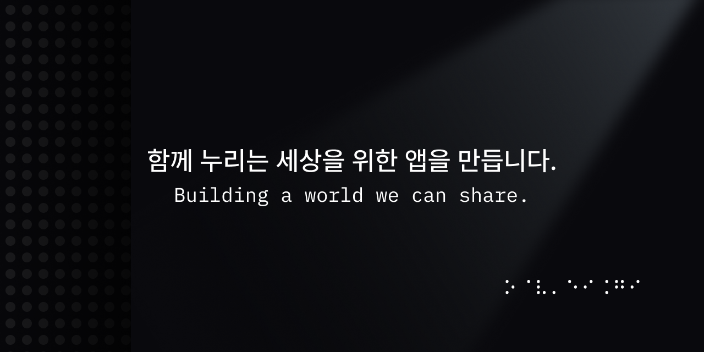

# 🎸 Offstage

> 함께 누리는 세상을 위한 앱을 만듭니다.  
> – 시각적 어려움을 가진 사람의 이동 불편을 줄이기 위한 프로젝트

<!-- []()
[]()
[]() -->

## 📱 소개

우리는 **시각적 어려움을 가진 사람이 버스를 탈 때 겪는 불편함**을 해소하는 것을 목표로 합니다.  
버스 정보 접근성의 장벽을 낮추고, 대중교통 이용 과정에서의 **불안과 소외감을 줄이는 경험**을 설계합니다.

우리의 시도는 단순히 기술적 해결을 넘어,  
누군가의 **작은 불편을 함께 짊어지는 방법을 탐구**합니다.

### 📡 공식 채널  

[](https://www.instagram.com/for.offstage/)  
[](https://x.com/for_offstage)


<!-- [🔗 앱스토어/웹 링크](https://example.com) -->

---

## 📆 프로젝트 기간
- 전체 기간: `2025.09.01 - 2025.11.27`
- 개발 기간: `2025.09 - 2025.11`

---

## 🚀 Getting Started


```sh
# 1. 프로젝트 clone
git clone https://github.com/DeveloperAcademy-POSTECH/2025-C6-M01-Offstage.git

# 2. 환경 준비 및 Git 훅 설치
make setup

# 3. 프로젝트 생성 및 Xcode 실행
make tuist-generate
```

🔎 개발/검증 워크플로우, 브랜치/커밋 규칙 등 자세한 내용은  
[온보딩 가이드](docs/onboarding-guide.md)를 참고하세요.  

---

## 🧑‍💻 팀 소개

| [Echo<br>(신민규)](https://github.com/shinmingyu)<br>Domain  | [Ell<br>(한주연)](https://github.com/1ONE111)<br>Domain  | [Kirby<br>(양서린)](https://github.com/bisor0627)<br>Tech | [Murphy<br>(유정민)](https://github.com/JMO307)<br>Design  | [ssol<br>(석민솔)](https://github.com/msseock)<br>Tech  | [Three<br>(이슬)](https://github.com/iamseulee)<br>Design |
|:---:|:---:|:---:|:---:|:---:|:---:|
| | | | | | |

> 모두가 돌아가며 Driver가 되는 구조로 협업하며,  
> 기술과 디자인을 넘어 **사람 중심의 작은 배려**를 실현하고자 합니다.

---

## 📝 License

This project is licensed under the [MIT License](./LICENSE).